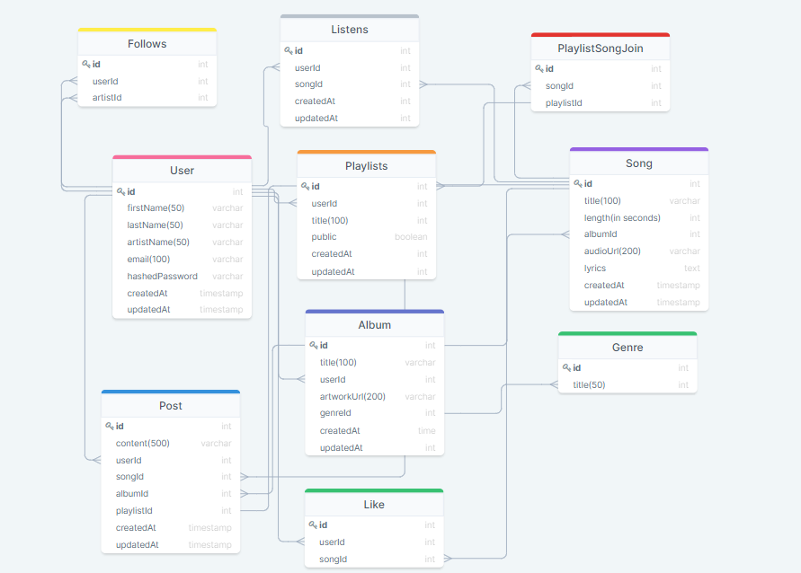

# Gaseous Sound

### Developed by Brandon Bartlett

  

## Purpose

Gaseous Sound is a Sound Cloud clone made as a one week solo project

during App Academy's curriculum to demonstrate mastery of React.js.

## Technologies Used

 - React.js
 - - React Router Dom
 -  - React Redux
 -  Express
 -  Sequelize
 - Node.js
 - AWS database (for audio and track images)
 - Postgres SQL (for everything else)
## Features

- Customized homepage for user
- User can make playlist
- - User can set privacy setting for playlist
- User can follow artists
- User can play other user's playlists
- User can repost songs and albums
- User can see songs and albums posted by other users
- User can navigate site without pause in playback (Mini player)
- User can upload audio
- - User can make albums out of uploaded songs
- - User can assign audio to a genre
- User can like songs
- User can see his/her recent listening history (last 4 songs)
- User can search for users, songs, and albums

#### Stretch Goals
- User can add comments on tracks at a certain timestamp
- User can see play count on songs

#### Super Stretch Goal
- User can embed player into other pages with an html tag

## Routes
### Frontend
- / (Home page. Will display music to listen to)
- /artists/:artistId (Will display artist information, songs, albums, playlists, posts)
- /artists/:artistId/albums/:albumId (Will display all tracks in album)
- /artist/:artistId/albums/:albumId/:songId (will display song info, player, and lyrics)
- /artist/:artistId/playlists (will display playlists made by artist)
- /artist/:artistId/playlists/:playistId (will display all tracks in a specific playlist)
- /artist/:artistId/playlists/:playlistId/:songId (will display song info, player, and lyrics)
- /artist/:artistId/playlists/:playistId (edit your playlist)
- /upload (can upload media)

### Backend
- GET /session/login (will validate user login)
- GET /session/signup (will validate user signup)
- GET /session/logout (will log user out)
- GET /artist/:artistId (will get artist info)
- GET /artist/:artistId/posts (will get artist's posts)
- GET /album/:albumId (will get album info)
- GET /song/:songId (will get song info)
- GET /genre/:genreId (will get tracks from genre)
- GET /user/home (will get all required info for the user's homepage)
- GET /user/history (will get user's listening history) //Private route
- POST /user/history (will add to users history) //Private route
- 

## Database Schema
